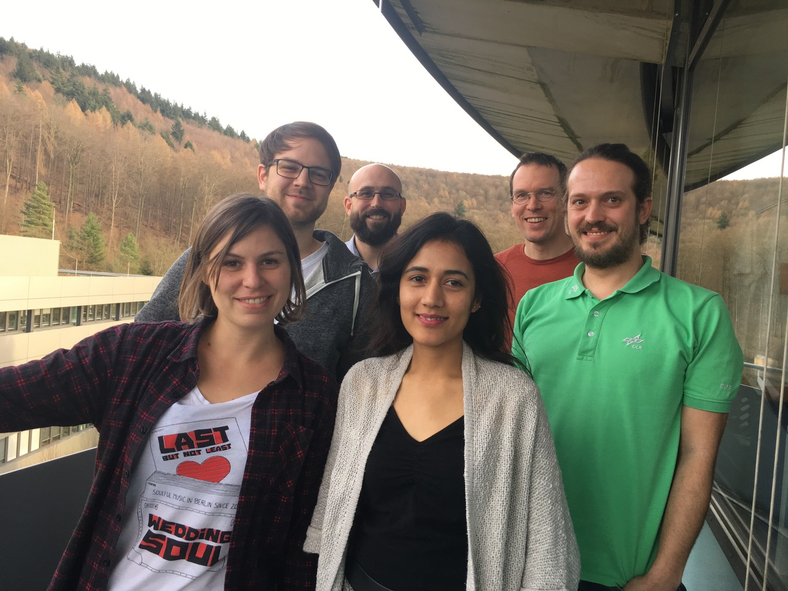

# Building communities to support Research Software Engineering: blog series

## 01: Background

So many of us have been fired up by the [UK Research Software Engineer (RSE) initiative](http://rse.ac.uk) and it's spread throughout further European Countries. The spark for this particular meeting started at the [Second RSE conference](http://rse.ac.uk/conf2017/) held in 2017. 

For me, the initiatives described by [Toby Hodges](https://twitter.com/tbyhdgs) at [European Molecular Biology Laboratory (EMBL)](https://www.embl.de/) at Heidelberg and [Tobias Schlauch](https://twitter.com/TobiasSchlauch) at the [German Aerospace Center (DLR)](http://www.dlr.de/sc/en/desktopdefault.aspx/tabid-1177/) had been two of my favourite talks and motivated me to find out more. I kept in touch with Toby and we informally swapped notes over online meetings. In the meantime Toby and Tobias had already been synthesising some of their experiences, published in [this post](https://www.software.ac.uk/blog/2017-12-13-encouraging-good-software-development-practice-research-teams) at the [Software Sustainability Institute's website](https://www.software.ac.uk/). I was also excited to see the results of the [German RSE](http://www.de-rse.org/en/) survey presented by [Stephan Janosch at FORCE17](http://www.de-rse.org/blog/2018/03/06/verteilung-der-umfrage-in-deutschland.html) but saddened by some of them.

In particular, too big a portion of German RSEs do not look forward to another day's work or see RSE as a long-term career option in that first survey. I wanted to give each one a giant hug! 

 
source: ['Results of RSE-de 2017 survey' presented at FORCE17 by Stephan Janosch](https://presentations.copernicus.org/FORCE2017-30_presentation.pdf)

While there's surely a whole host of reasons, we all feel an important aspect of the UK RSE initiative has been to gather us up into a community. With that in mind, an interesting question arose: 

> How can we leverage community to spread better research software development practice and create a better working environment for all?

And how better to answer it than to get around a table and swap notes on our experiences of community building so far? 

Motivated by a need to learn more about building remote communities, with a view to expanding the community beyond their locale, the [EMBL Bio-IT](https://www.embl.de/research/interdisciplinary_research/bioinformatics/community/bio-it/) biocomputing community made arrangements to host us all at their site in Heidelberg and set the date for 24 Jan 2018. Myself and Stephan were also supported by the Software Sustainability Institute and EMBL Bio-IT respectively who covered our costs for the trip.

## Participants

 
_Clockwise from bottom-left: Anna Krystalli, Stefan Helfrich, Toby Hodges, Stephan Janosch, Michael Meinel, Malvika Sharan_

Toby Hodges, Malvika Sharan, and Georg Zeller shared experiences from EMBL Bio-IT, with a brief appearance (via video call) from Aidan Budd to provide details of the early days; Michael Meinel representing the DLR took Tobias Schlauch' place who sadly could not join; Stephan Janosch brought experiences from a number of initiatives, spanning from his local institution Max Planck Institute of Molecular Cell Biology and Genetics ([MPI-CBG](https://www.mpi-cbg.de/en/home/), via the [Dresden Concept](http://www.dresden-concept.de/en/home.html), a research alliance among 24 Dresden-based research institutions, to the national de-RSE network of German RSEs; Stefan Helfrich, an excellent impromptu addition resulting from Toby's involvement in [the Carpentries' mentorship groups program](https://github.com/carpentries/mentoring/tree/master/mentoring-groups), represented the Network of European Bioimage Analysts ([NEUBIAS](https://eubias.org/NEUBIAS/)) as well as German BioImaging ([GerBI](http://germanbioimaging.org)).

My own interest came from exploring the literature on [**communities of practice**](http://wenger-trayner.com/introduction-to-communities-of-practice/) for a proposal I was writing. Communities of practice provide a domain specific platform through which to bringing outsiders in through practice and participation. A productive and creative culture is established through shared, codified repertoires of best practice and supplemented by channels of tacit knowledge flow. Their magic lies in the social capital they create across the network of collaborative relationships they foster. 

Some of the most successful modern communities of practice are digital open source communities. They leverage the internet and digital tools to codify, document, develop, share and communicate community knowledge, expand networks and culture, and actively invite and encourage participation. In turn they have made the internet the rich place it is today. 

I also quickly realised I had experienced some great examples of such open source communities from which to draw inspiration. From the [Mozilla Open Leaders mentorship program](https://mozilla.github.io/leadership-training/), [rOpenSci](https://ropensci.org/) and wider [R programming community](https://www.r-project.org/), to local communities, as a co-organiser of the [R Users group](https://www.meetup.com/SheffieldR-Sheffield-R-Users-Group/) and the nascent [dataviz.shef](http://dataviz.shef.ac.uk/) initiative looking to build community around data visualisation across the University of Sheffield.

As community builders seeking to facilitate broad culture change and capacity building in computational research practice, there is much to emulate from open source approaches. But once we've shown researchers some of the tools at their disposal, how to use them and some best practice guidelines, success depends very much on their response to the challenge we are effectively posing to them as users, beautifully articulated in the intro to [**open advice**](http://open-advice.org/#rmobox):

> Yes, users. Even if you did not realise it or "never signed up for no community," you in fact are already a part of this community. The question is whether you'll choose to participate actively.

**A lot more is possible if they are willing to participate.**

## On the Day

The motivation for this meeting was to swap notes on what we've tried already to build community, what worked particularly well and identify challenges and steps for the future.  Here we try and pull together some recurring threads in our experiences. But please note that the examples mentioned in this blog are by no means exhaustive. 
