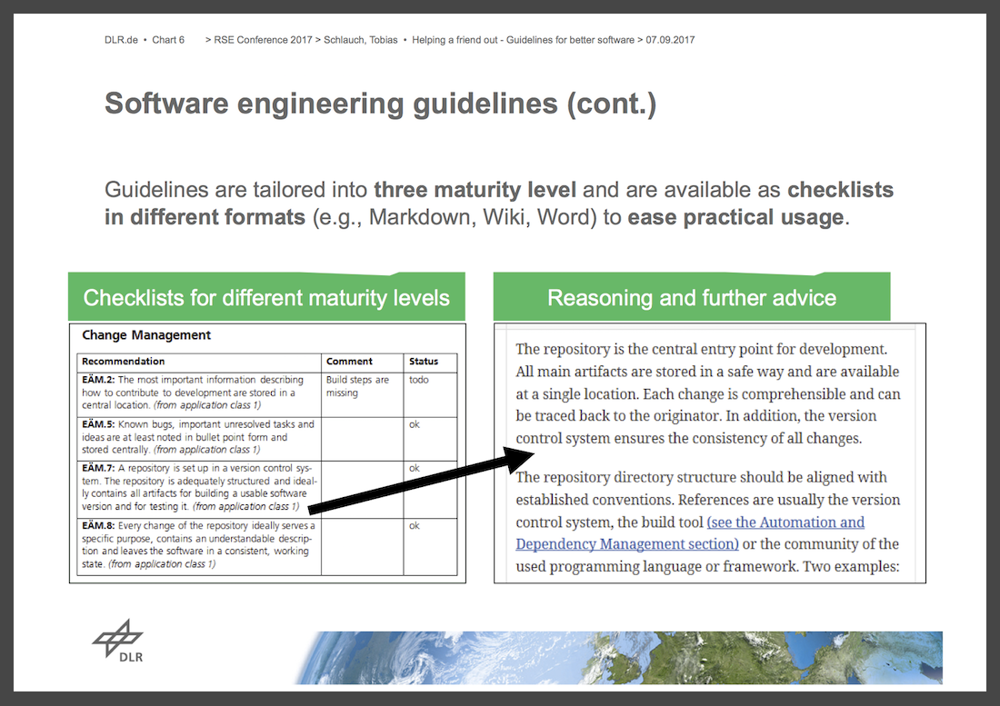

# Building communities to support Research Software Engineering: blog series

```
add short intro
```

## 02: What Works

### Knowing your community

This is fundamental to the community's ability to add value and should be one of the first community development steps. We need to know both where the community is at and where they want to go. Activities responsive to such community goals, needs and aspirations will generate a higher rate of engagement and voluntary participation.

*And it all started with a survey*: we all started with some form of surveying our communities. But on-going revisiting and reflecting on such fundamentals is important for community sustainability. 

### Effective communication channels

**Community == communication**

Effective communication channels are vital for both the transfer and processing of information, particularly of tacit knowledge, but also for fostering social, collaborative relationships. Across the various initiatives, approaches tried include mailing lists, [Slack](https://slack.com) and [Glip](https://glip.com) channels, [Google Groups](https://groups.google.com/) and other discussion forums. 

A stand out example of community communication is the [mattermost](https://about.mattermost.com/) based Bio-IT internal chat system, set up by community members. Fine control of the features and privacy of the system has made it highly adaptable to serving the community's needs. Coupled with an internally hosted [GitLab](http://gitlab.com/) based repository system, they've managed to build a thriving complementary online community actively engaged in sharing, co-developing, reviewing and discussing their software. The only drawbacks are that it can be difficult to open up discussion to the outside world. 

But it's important to note that it's often more efficent to signpost and develop links across communities than trying to reproduce parallel versions. For example, for R questions beginners might have, I would unhesitantly guide learners to the [R for Data Science (#R4DS) slack community](https://medium.com/@kierisi/r4ds-the-next-iteration-d51e0a1b0b82). The 1000+ strong slack team of mentors and learners is a constant hive of discussion, trouble shouting and sharing wins while working through [R for Data Science](http://r4ds.had.co.nz/). For slightly more technical questions, I might guide someone to the [rOpenSci](https://ropensci.org/) [slack community](), the [rOpenSci](https://discuss.ropensci.org/) or [Rstudio](https://community.rstudio.com/) discussion boards (powered by [discourse](https://www.discourse.org/), another nice open source community building resource) or #rstats [stackovelflow](https://stackoverflow.com/questions/tagged/r).

Overall to be successful, they'll need to be diverse enough to allow for varied communication styles, including the option for private communication, but to be most effective they're better when they are integrated.

### Codifying and documenting community practice.

A foundational resource for establishing community culture and practice is the codification and dissemination of standards and guidelines. The German Aerospace Center (DLR) approach is a particular great example. They make use of wikis and check lists in a variety of formats (e.g. Markdown and Microsoft Office Word) to help guide software development. They have established a minimum requirement for all software and further recommendations follow a tiered level fremwork determined by a project's application class, in particular the software scope and size. Individual recommendations are linked to reasoning and further advice which helps researchers understand and get behind the recommended practices. Importantly, the group work with contacts at each institute of the DLR to regularly get feedback on evolving requirements for guidelines, new tools and training. 


<br>
_Slide from Tobias Schlauch's_ [_talk_](http://rse.ac.uk/conf2017/wp-content/uploads/sites/2/2017/11/Helping-a-friend-out-%E2%80%93-Guidelines-for-better-software_4_3.pptx) _at 2nd RSE conference: 'Helping a friend out: Guidelines for better software'_.

Materials are currently in German but as we eagerly await their translation into English, perhaps this is somewhere the RSE community can help, by establishing community translation initiatives (see this [excellent post by Achintya Rao](https://medium.com/@RaoOfPhysics/a-guide-to-collaborative-translation-workflows-48c259100614) on how collaborate translation could be supported). 

More broadly, excellent Guidelines of Best Practice and documentation are emerging, e.g.

- the Netherlands [eScience Centre Guide](https://guide.esciencecenter.nl/). 
- the rOpenSci [Reproducible Research Guide](https://ropensci.github.io/reproducibility-guide/)
- the British Ecological society  Guides to [Data Management](https://www.britishecologicalsociety.org/wp-content/uploads/2017/06/BES-Data-Guide-2017_web.pdf) and [Reproducible code](https://www.britishecologicalsociety.org/wp-content/uploads/2017/12/guide-to-reproducible-code.pdf)
- [The Practice of Reproducible Research](https://www.practicereproducibleresearch.org/): Case Studies and Lessons from the Data-Intensive Sciences

Efforts also take the form of laboratory level project management policies and tools e.g.

- [Kirstie Whittaker](https://github.com/WhitakerLab/WhitakerLabProjectManagement) and [Christie Bahlai](https://github.com/BahlaiLab/Policies/blob/master/Project_completion.md)'s lab policies.
- [Ben Marwick lab's `rrtools`](https://github.com/benmarwick/rrtools), open lab level tools for setting reproducible research projects

At this point, it feels like we should be building upon and refining such efforts rather than duplicating them and feel that focusing on developing reusable, customisable templates to help guide best practice would serves us well.

Having said all this, it is important to note that community documentation can take many forms, including blogs, wikis, READMEs, bug reports, discussion boards and sites like Stack Overflow. It still blows my mind that the substantial R-related content on Stack Overflow, without which I would have never completed a PhD, was seeded by a [flashbombing the site with R questions and answers](http://www.decisionsciencenews.com/2009/09/03/r-flashmob-2-tuesday-8-september-2009/) back in 2009, and arguably became a foundational online knowledge base for the R community. Such repositories of tacit knowledge provide platforms for the community to process information and incorporate into refinements of tools and best practice guidelines.

### Actively fostering engagement and participation

Successful communities thrive on diverse contributions from a wide range of their members. Most of the attendees at this particular meeting were representing the efforts of a much broader selection of contributors to their respective communities. The role of a community coordinator is often to encourage and facilitate the voluntary efforts of the larger group, and it is this engagement across the whole community that, in turn, produces the most amazing results. To get some idea of the number of individual contributions that it can take to create a successful community, check out the Acknowledgments slide from [Toby's talk at RSE17](http://rse.ac.uk/conf2017/wp-content/uploads/sites/2/2017/11/Bioinformatics_Community_Hodges_RSE17_2.pdf)!

Welcoming, supportive active community catalysts [can have a huge impact in setting the tone](https://ropensci.org/blog/2017/07/18/value-of-welcome/), and can be the deciding factor on whether newcomers choose to stay and participate. It's no surprise we routinely ended up back at Bio-IT t~0~, and **Aidan Budd**'s initial vision, drive and ability to be the hub that drew other people together. Other great examples include **Maëlle Salmon** ([\@ma_salmon](https://twitter.com/ma_salmon)) as an **rOpensci** package review editor, **Stefanie Butland** ([\@StefanieButland](https://twitter.com/StefanieButland)) as **rOpensci** community manager and **Jesse Maegan** [\@kierisi](https://twitter.com/kierisi) for establishing [#R4DS](https://medium.com/@kierisi/r4ds-january-challenge-69324561ef2b) and Abigail Cabunoc Mayes, ([\@abbycabs](https://twitter.com/abbycabs)) Practice Lead of the Mozilla Working Open mentorship program. 

Ultimately, though, it's about member participation, so the superpower of great community catalysts is to actively acknowledge and promote member contributions and help them share their stories, ideas and questions. And while this all may come more naturally to some, we can all aspire to be better community catalysts.

I'll leave you with another quote from open advice, this time by [Jono Bacon]():

> I have talked about there being two types of community managers;
> those who go out and give presentations and wave their hands
> around talking about a product or service, and those who work with
> a community of volunteers to help them to have a fun, productive
> and enjoyable collaborative experience. I am more interested in the
> latter – I feel that is what a real community manager does. 

### Training

We all identified providing training, developing materials and workshops still fundamental to baseline computational skill development. Initiatives like the Carpentries or Elixir are making huge strides in establishing the foundations for scaling. We also all recognised the importance of flexibility and hearing from your community and being able to adaptively develop training according to identified domain needs. 

But to for both individuals and the community to reap the benefits of technical training, it's important to equip researchers with the digital citizenship skills required to be effective nodes. The ability to access and recycle material, share through and post to the web are incredibly empowering, but only up to a point. Being able to effectively propose an idea, share it, build it in the open, get feedback, onboard collaborators and incorporate contribution underpin the emergent community social capital and knowldege flow we see in open source communities today. So skills in collaboration, leadership, mentorship and even asking for and giving help are critical. Additionaly, an ability to iterate in response to user feedback requires humility, openness and transparency. As community leaders, we set the precedent and the tone for any community so effective leadership must be driven from the position of a peer. 
 
### Events!

Communities are above all social so bringing people together through events is vital. To keep people engaged and maximise participation, good variety and rhythm are key.

Conferences are still a great place to get together and there is no doubt that the RSE conferences have been a huge spring board for the UK RSE community and beyond. The centrality of the [conference](http://eubias.org/NEUBIAS/neubias2020-conference/symposium2017-lisbon/) in the maintenance of the NEUBIAS community also speaks volumes about the importance for technical disciplines of science to have that space for knowledge exchange and network building. Since members of the NEUBIAS community are spread all over Europe with small communities (if at all) at their local institutes, an annual conference offers great possibilities to get work done. This is especially important since many members are in scientific support positions with little time to get involved in community activities during working hours. Conferences attendence, however, implies blocked time on the calendar and offers the chance to collaborate "offline".

But there's a lot more fun we can have with events! For example my favourite thing to organise is hackathons! Academic "fun" hacks can be a sociable and effective way of getting people to learn/practice new things and tackle challenges in their field without pressure and with the support of others. They are great opportunities to practice more fundamental skills like using version control systems to collaborate online while hack themes can provide opportunity to delve into more specific topics. For example, the Reproducibility hackathons ([#ReproHack](http://rse.shef.ac.uk/blog/opencon_london/)) we organised as part of the OpenCon Berlin (2016) and London (2017) satellite events, gave participants the opportunity to explore other people's code and data and get exposure to different approaches to making research reproducible.

Other more focused learning sessions like **coding clubs** and **training schools/learnathons** are great ways to bring people together to work on more advanced topics and get feedback. Coding clubs work best when sessions are focused, like working through a book, training program or even blogposts. In the case of workshops, as materials have to be moderated/prepared by someone, the events have the side-effect of bringing together not only learners but also trainers over a period of time that facilitates fruitful discussions.

Note that local events can also now easily open up proceedings to remote participants. Streaming or recording events, allowing call ins or even just opening a gitter channel or posting links to live documents could help broaden engagement.

Final top tip: Food and drink == always a winner! 

### Buy in from upper management + funding

One of the key drivers of the longest standing and most developed communities is buy in and support from upper management or sponsorship early on. Bio-IT benefited by a need for the initiative being flagged early on and led to them now having nearly 8 years of well-resourced effort under their belt. Similarly, the DLR initiative was driven by first raising awareness at upper management level which subsequently lead to upper management support.

Related to buy in is financial support of activities. At the very least, funding for dedicated community building personnel can provide an important start. e.g. 

```
EMBL and DLR <- want to expand on the funding?> 
```

and Mike Croucher's EPSRC Fellowship supported such seed roles at the University of Sheffield. 

Since research is an inherently international and/or multi-organization endeavor, financial support from umbrella organization can also be sought. The European Union, for instance, has established a programme (COST) for setting up international research networks which supported costs associated with NEUBIAS setup, events (conferences, training schools, short scientific exchanges) and networking activities. Additional information on funding schemes is described in [Eisfeld-Reschke J., Herb U., Wenzlaff K. (2014) Research Funding in Open Science. In: Bartling S., Friesike S. (eds) Opening Science. Springer, Cham](https://doi.org/10.1007/978-3-319-00026-8_16).