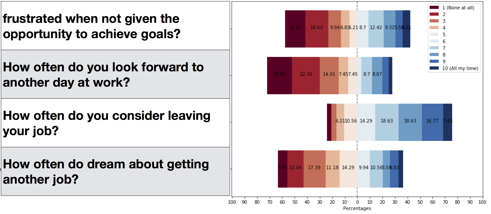

# Building communities to support RSE

## Background

So many of us were fired up by the UK RSE intitiative and the spread to more European Countries. The spark for this particular meeting started at the 2nd RSE conference. For me, the inititiatives described by Toby Hodges' at [EMBL](https://www.embl.de/) and Tobias Schlauch's at the [DLR](http://www.dlr.de/sc/en/desktopdefault.aspx/tabid-1177/) talks had been two of my favourite and motivated me to find out more. I kept in touch with Toby and we informally swapped notes over skype. In the meantime Toby and Tobias' had already been synthesising some of their experiences, the results of with can be found in this [SSI blogpost](https://www.software.ac.uk/blog/2017-12-13-encouraging-good-software-development-practice-research-teams). I had also been slightly saddened by some of the results of the german RSE survey presented by Stephan Janosch at FORCE17.

source: ['Results of RSE-de 2017 survey' presented at FORCE17 by Stephan Janosch](https://presentations.copernicus.org/FORCE2017-30_presentation.pdf)      

In particular, many German RSEs in that first survey do not look forward to another day's work or see RSE as a long-term career option (...what?!). I wanted to give each one a giant hug! While there's surely a whole host of reason's, we feel an important aspect of the UKRSE initiative has been to gather us up into a community. With that in mind, An interesting question arose: 

> How can we leverage community to spread better research software development practice?

And how better to answer it than to get round a table and swap notes on our experiences of community building so far. Motivated by a need to learn more about building remote communities, with a view to developing connections for Bio-IT beyond their locale, EMBL Bio-IT made arrangements to host us all at their site in Heidelberg and set the date for 24 Jan 2018. Myself and Stephan were also gratefully supported by the SSI and EMBL Bio-IT respectively who covered our costs for the trip.

 
 

## participants

 
_Clockwise from bottom-left: Anna Krystalli, Stefan Helfrich, Toby Hodges, Stephan Janosch, Michael Meinel, Malvika Sharan_

Toby Hodges, Malvika Sharan, and Georg Zeller shared experiences from EMBL Bio-IT, with a brief appearance (via video call) from Aidan Budd to provide details of the early days; Michael representing the DLR took Tobias' place who sadly could not join because of illness; Stefan Janosch brought experiences in a number of initiatives, spanning from his local institution Max Planck Institute of Molecular Cell Biology and Genetics, via the Dresden Concept, a research alliance among 24 Dresden based research institutions and at the national level, to the de-RSE network of German RSEs; Stefan Helfrich, an excellent impromptu addition resulting from Toby's involvement in [the Carpentries' mentorship groups program](https://github.com/carpentries/mentoring/tree/master/mentoring-groups), represented the NEUBIAS network of image analysts.  

My own interest came from exploting the literature on [**communities of practise**() for a proposal I was writing and it struck me that I'd already had experience of some very successful examples of such communties. As a member of the Mozilla Open Leaders mentorship programme, the rOpenSci and wider r community but also more locally as a co-organiser of the R Users group, We've also recently been trying to apply many of these ideas on a cross-departmental team charged with building community around data visualisation across the University of Sheffield. 

ound by a domain specific domain, bringing outsiders in through practice and participation
Their magic lies in the social capital they create, the network of collaborative relationships and a shared, codified repertoir of best practice, supplement by channels of tacit knowledge flow.

> Yes, users. Even if you did not realize it or “never signed up for no community,” you in fact are already almost part of ours. The question is whether you’ll choose to participate actively.

Some of the most successful modern communities of practice are digital open source communities. They leverage the internet and digital tools to codify, document, develop, share and communicate community knowledge,  networks for knowledge and culture propagation and actively invite and encourage participation. In our quest to spread better computational practice across research, not ignoring the irony that the internet itself was built for scientists to share information and with industry constantly pied pipering away skills and talent, it is clear that we need to stick together, make the most of our efforts and look to open source communities for inspiration on how to facilitate change.

Please note that the examples and people mentioned are by no means exhaustive. The idea however was to swap notes on communities we have experience of. The idea was to swap notes on what we've tried already to build community, what worked particularly well and identify challenges and steps for the future.

Here we try and pull together some recurring threads in our experiences.

## On the Day

### what works

#### Knowing your community

This should be close to the first step in building any community and is imperative for adding value which in turn is what drives voluntary participation.

And we all started with a surveys: we all started with some form of surveying our communities. An important aspect of surveying for information is to find out both where the community is at and where they want to go. Activities can then be targeted towards the wishes of the community and a higher rate of engagement and voluntary participation.

**more detail on what the NEUBIAS COST action funding was used for

- NEUBIAS H2020 COST action funding
- EMBL - high level funding and top level buy in!
- Sheffield - Mike Croucher's EPSRC Fellowship
     - DLR: getting the right people in the room: community above individuals

#### Effective communication channels

> Community == communication

Important for both the transfer of information, particularly of tacit knowledge,, but also be social to foster collaborative relationships so will likely be multi-pronged. Across the various initiatives we were sharing experiences one, all forms have been tried, from the mailing lists, google groups, slack channels

An excellent example is the [mattermost](https://about.mattermost.com/) based internal chat system EMBL Bio-IT have developed as an internal communication system. The control and privacy is a big benefit of this approach but can be difficult to communicate with the outside. More open channels that are being successfully used to power all sorts of open source and data science communities including the ukrse slack channel. 

Really important for making people feel connected to each other.

But the beauty of many tools re beginning to crossover into self-documentation. Blogs and Discussion boards, whether through google groups or the awesome [discourse](https://www.discourse.org/) boards used, for example, by [rOpenSci](https://discuss.ropensci.org/). Great moderators can channel useful discussions on chat channels to better curated discussion boards. 

#### Codifying and documenting community practice. Tooling

Beyond trading stories however, there is a need for foundational tools and documentation codifying best practice and forming and forming a foundational resource from which best practice can be codified and built on. This includes blogs, discussion forums, white papers and standards. THere is likely much scope for development here to support the kind of documenation. We are all eagerly awaiting the translation of the DLR documentation materials into english. They had a really intersting concept of a tiered level of application classes, each according to the research project scope and size with it's own documentation recomendations, as well a minimum requirement for all software according to .

Again, it's hard to quantify quite the effect that sites like stack overflow, and indeed tha flash bombing of the site with R, but their foundational role in proving foundations for which a knowledge exchange community can be built upon. 

The DLR approach is a particular great example of how codification through guidelines of practice and community practice feedback into each other. While tasked with developing a framework for sustainable software development, the group work with contacts at each institute of the DLR from which they gain feedback on the direction of bith the requirement for guidelines, new tools and training. 
They make use of wikis, but also check sheets in a variety of formats (eg markdown & word) linked to reasoning and further advice next to each point. Actually looks very similar to the rOpenSci onboarding review checklist. 

Clearly there is a lot well deserved effort into Guidelines of Best Practice and doucmentation, and we feel good foundations are being laid, for example the Netherlands eScience Centre Guide. With all these, building upon rather than duplicating would serves us well. From there, as Research Software engineers we can support by customatisable templating.

#### Actively fostering engagement and participation

Successful communities thrive on diverse contributions from a wide range of their members. Most of the attendees at this particular meeting were representing the efforts of a much broader selection of contributors to their respective communities. The role of a community coordinator is often to encourage and facilitate the voluntary efforts of the larger group, and it is this engagement across the whole community that, in turn, produces the most amazing reults. To get some idea of the number of individual contributions that it can take to create a successful community, check out the Acknowledgments slide from [Toby's talk at RSE17](http://rse.ac.uk/conf2017/wp-content/uploads/sites/2/2017/11/Bioinformatics_Community_Hodges_RSE17_2.pdf)!

Alot of this however falls in the least recognised and appreciated category. The importance of community catalysts

Aidan Budd. We routinely ended up back at t0, being inspired by Aidan Budd's vision and drive. A catalysing froce as a driver of community building initiative is an invaluable resource and I can think of many I mentioned 

#### Training

 
We all identified providing training, developing materials and workshops still fundamental to baseline computational skill development. Initiatives like the Carpentries or Elixir are making huge strides in providing scaling training foundations. We also all recognised the importance of flexibility and hearing from your community and being able to adaptively develop training according to identified domain needs. 

But to make researchers effective nodes, we feel it's important to provide training for the development of digital citizenship skills. Collaboration, leadership, mentorship and even finding information and getting help are underpin emergent community social capital. The ability to access and recycle material, share through and post to the web are incredibly empowering in their own right. 
 
 
#### Events!
 
 
  Done well, many of this activities can be succesful also online. For example, The Mozilla Open Leaders mentorship programme, the Global Sprint or Hacktoberfest are great examples of online mobilisation of activity.
  
 But bringing people together in physical space still the most effetive way of building community.
 
 - conferences: There is no doubt that the RSE conferences have been a huge spring board for the RSE community. Traditional venues for knowledge exchange and network building are still important and the NEUBIAS conferences also demonstrate that it is important to provide these opportunities for technical disciplines of science. But we could also push forward by carving out workshops and sessions at larger scientific conferences. We need to continue being present in research, interacting with researchers and understanding the sorts of questions they are trying to answer and the digital materials they are using to do so. 
 - hacks: I love hacks! Academic "fun" hacks can be really fun but also very effective in getting people to learn/practice new things and tackle challenges in their field without pressure. Food and drink always helps! With the dataviz team we regularly schedule work hacks, where we hammer out a bit of work, or prototype something. But jumping onto wider events, like running a Global Sprint site or some hacktoberfest sessions. They are great opportunities to practice more fundamental skills like collaborating online and get a feel for open source.
 - coding clubs
  Great ways to provide opportunity to learn, practice (after training?) and get feedback. Works best when sessions are focused, like working through a book, training program or even blogposts. Relying on attendees to provide content can lead to dwindling engagement. I'd also like to plug the Advent of Code as a great learning opportunity. 

Note that local events can now relatively easily open up proceedings. Live streaming or recording and posting events and setting up open, live communication channels around the event are great ways to engage remote participants and indeed, I've recently been calling in to the EMBL Bio-IT [D3.js coding club]()!

#### Buy in from upper management

One of the key drivers of the longest standing and most developed communities is buy in and support form upper management. Bio-IT benefited by this being flagged early on in the process and lead to them now having nearly 8 years of well resourced effort. Similarly the DLR initiative was driven by first raising awareness in management level which subsequently lead to upper management support.

#### Funding!

Related to buy in is financial support of activities. At the very least, funding for dedicated community building personnel can provide an important start. eg EMBL and DLR and Mike Croucher's EPSRC Fellowship supported such roles.   
 

### continuing challenges?

#### moving from a top down to a decentralised model. 

Ie a self-sustaining community. volunteers to contribute content. It is not news to anyone that one of the most challenging aspects of sustaining comunity is enlisting contributions, mainly in the form of contributions. 

To a certain extent, dedicated seed staff will likely be an important determinant of whether a community succeds. But making the most of available tools can really help with the decentralisation. Automation, reusable templates and open sharing of resources can really help with compiling and spreading best practice and useful tools while the plethora of communication means put to good use can break down physical barriers and link people into communities while, if done in the open, also acting as an archive. 

#### lack of funding & recognition.

- Important point I found interesting:
    * both EMBL Bio-IT and DLR had not realised how far ahead they were in the areas they were leading. 

Tobias just saw it as part of his job and assumed everyone did the same.

RSE UK has definitely been a big driver of raising awareness and our experiences here it Sheffield with having 2 of the first fellows has shown it can work as a start. But ultimately without buying and support for activities that push forward, it's hard to build momentum. 

Many of the activities are often undervalued and therefore difficult to attract funding.

#### Measuring success.

Time and again, and related to why these skills aren't appreaciated, we find it difficult to measure and promote the effect of such community and capacity building efforts. Hard to link to publications. An particular difficulty raised by the DLR team is how to measure improvements in the **quality** of software produced. Ultimately, this is what determines whether research software is more dependable and ibndeed more reusable.

#### people still feel isolated (especially when disparate in physical location). This is particularly the case of the NEUBIAS disconnected (SJ & SH). Result:
    

> Because as Ḱevin Ottens rightly said during the Desktop Sum mit 2011 in Berlin: “Community building is family and friendship building.”

## Future

### Community calls

- Ultimately, we had to start somewhere and started with a few folks that had co-expressed an interest to each other of learning more about each others work. However much talk centered around many others that have inpired usm pushed community forward and would likely have much to contribute to things we discussed.

- Also, while UK RSE is bringing people together, German RSEs still feel isolated

So it's key to open our discussions up. In the coming weeks, Toby and Malvika hope to organise the first in a series of open calls for anyone interested in building communities. The first call planned will focus on strategies to bring geographically isolated individuals into a community, addressing the feelings of loneliness and lack of in-person contact described above. Anyone reading this is welcome to attend: watch this space for further updates!

### Reusable, customisable templates (ie stop re-inventing the wheel)

### iterating

- measuring the impact, in particular the QUALITY of the code, something the DLR had had to grapple with more so due to the production nature of alot of their software.

<blockquote class="twitter-tweet" data-lang="en">
What it takes to build a successful, supportive and responsive bioinformatics community by <a href="https://twitter.com/tbyhdgs?ref_src=twsrc%5Etfw">@tbyhdgs</a>   ❌ ban loneliness in research ❌ <a href="https://twitter.com/hashtag/RSE17?src=hash&amp;ref_src=twsrc%5Etfw">#RSE17</a> <a href="https://t.co/VdIeZS8Gyj">pic.twitter.com/VdIeZS8Gyj</a>
&mdash; annakrystalli (@annakrystalli) <a href="https://twitter.com/annakrystalli/status/906139603140214785?ref_src=twsrc%5Etfw">September 8, 2017</a></blockquote>

